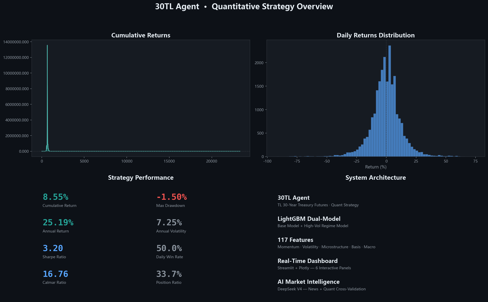

# 30TL Agent — 国债期货量化策略系统

[中文](#) | TL 30年期国债期货 · 量化投机策略 · AI驱动分析



## 项目概述

基于 **LightGBM 双模型**（基础模型 + 高波动/趋势市模型）的 TL（30年期国债期货）量化投机策略。整合量价、微观结构、基差和宏观因子，预测 30 分钟 forward return，分市场状态执行多空交易。

核心能力：
- **量化交易** — 56 维精选因子 → LightGBM 双模型 → 分状态动态信号
- **AI 情报** — DeepSeek V4 债市新闻分析 + 量化数据交叉验证
- **研究 RAG** — 中金所月报/央行报告/券商研报语义检索 + 生成式问答
- **可视化** — Streamlit 7 面板交互式 Dashboard

## 核心特性

- **双模型架构** — 基础模型 + 高波动/趋势市专用模型，自适应市场状态
- **训练窗口优化** — 9 个月滚动窗口 + 60 天半衰时间衰减权重，Sharpe 提升 2.37x（0.85 → 2.01）
- **MAE 损失函数** — 对 30 分钟级离群收益更稳健，Normal 市场 IC 从 -0.20 转正至 +0.03
- **55 维精选因子** — 动量、波动率、微观结构、量价、技术、基差、宏观 7 大类
- **实时信号生成** — 每日更新行情 → 因子计算 → 模型推理 → 交易信号
- **AI 市场情报** — DeepSeek V4 自动抓取债市新闻 + 量化数据交叉验证 → 结构化分析报告
- **研究 RAG 工具** — 央行货政报告 + 中金所月报 + 券商研报 + 债券新闻语义检索，DeepSeek 生成式问答
- **可视化 Dashboard** — Streamlit + Plotly 7 面板交互式看板

## 回测表现

> 测试集: 2025-02-06 ~ 2025-05-27 (94 个交易日)，训练窗口: 9 月 + 60d 衰减

| 指标 | 数值 | 指标 | 数值 |
|------|------|------|------|
| 累计收益 | 9.67% | 年化收益 | 28.06% |
| 夏普比率 | **2.01** | 最大回撤 | -2.56% |
| Calmar 比率 | **10.94** | 年化波动 | 12.95% |
| 日胜率 | 45.9% | 持仓比例 | 39.4% |

### 分市场状态表现

| 状态 | 占比 | IC | 收益贡献 |
|------|:--:|:--:|:--:|
| 正常市 | 83.1% | +0.034 | +10.40% |
| 高波动市 | 15.7% | -0.021 | -0.02% |
| 趋势市 | 1.2% | +0.096 | -0.85% |

## 系统架构

```
┌──────────────────────────────────────────────────────┐
│                    Data Pipeline                       │
│  AKShare API → 分钟行情 · Tick快照 · 宏观数据 · 新闻    │
└────────────────────────┬─────────────────────────────┘
                         ↓
┌──────────────────────────────────────────────────────┐
│                  Factor Engine                         │
│  56 Features: 动量 · 波动率 · 微观结构 · 宏观 · 基差    │
└────────────────────────┬─────────────────────────────┘
                         ↓
┌──────────────────────────────────────────────────────┐
│              LightGBM Dual Model                       │
│  Base Model + High-Vol/Trend Model → 30min Forecast   │
│  9-Month Window + 60d Time Decay Weights               │
└────────────────────────┬─────────────────────────────┘
                         ↓
┌──────────────────────────────────────────────────────┐
│                  Output Layer                          │
│  Dashboard(7 Tabs) · AI情报分析 · RAG研究检索           │
│  Agent交互查询 · Signal.json                           │
└──────────────────────────────────────────────────────┘
```

## 快速开始

```bash
# 1. 安装依赖
pip install -r requirements.txt

# 2. 设置 API Key (AI情报分析 & RAG 问答功能)
set DEEPSEEK_API_KEY=your_deepseek_api_key

# 3. 训练模型 + 回测
cd src
python main.py --mode train

# 4. 生成实时信号
python main.py --mode inference

# 5. 构建 RAG 研究知识库 (首次使用需运行)
python rag_tool.py build

# 6. 启动 Dashboard
streamlit run dashboard.py

# 7. CLI 工具
python strategy_agent.py --query briefing      # 市场快照
python rag_tool.py search 央行降息空间还有多大  # RAG 检索
```

## Dashboard 面板

| Tab | 功能 | 说明 |
|-----|------|------|
| 信号看板 | 当前交易方向/置信度/仓位 + 近一周预测走势 | 模型实时推理 |
| 市场监控 | K线图 + 成交量 + 波动率 + 市场状态分布 | 含交易时段过滤 |
| 因子分析 | 特征重要性 Top15 + 因子分位图 + 异常预警 | 红色=极值偏离 |
| 回测表现 | NAV曲线 + 回撤 + 日收益分布 + 12项风险指标 | 全量样本外评估 |
| 宏观环境 | 收益率曲线形态 + 中美利差 + 宏观指标趋势 | 含月前对比 |
| AI情报分析 | DeepSeek V4 综合量化数据+新闻 → 结构化报告 | 4板块输出 |
| **研究RAG** | 研报语义检索 + AI生成式问答 + 文档类型过滤 | 165个文本块索引 |

## 目录结构

```
30TL_Agent/
├── data/                  # 原始数据（行情/宏观/Tick/RAG索引）
│   ├── macro/             #   宏观数据缓存
│   ├── tick/              #   Tick 数据
│   └── rag/               #   RAG 索引 (ChromaDB + 研报缓存)
├── models/                # 训练好的模型
├── outputs/               # 因子/信号/回测结果/AI报告
├── src/                   # 源代码
│   ├── main.py            # 入口：train / inference
│   ├── LightGBM_model.py  # LightGBM 双模型训练 (V3.2)
│   ├── inference.py       # 实时信号生成
│   ├── backtest.py        # 分状态回测引擎
│   ├── factor_extraction.py  # 因子构建
│   ├── macro_factors.py   # 宏观因子计算
│   ├── data_fetcher.py    # AKShare 宏观数据采集
│   ├── dashboard.py       # Streamlit 7 面板 Dashboard
│   ├── llm_intelligence.py   # DeepSeek AI 情报分析
│   ├── rag_tool.py        # RAG 研究工具 (爬取+索引+检索+生成)
│   └── strategy_agent.py  # Claude Agent 交互层
├── tools/                 # 工具脚本
├── docs/                  # 文档与截图
├── imp.md                 # 模型优化记录 (8轮迭代 + 训练窗口实验)
└── requirements.txt       # 依赖清单
```

## RAG 研究工具

基于 ChromaDB + BGE-small-zh 中文 Embedding 的研报语义检索引擎。

**数据源 (4类):**

| 来源 | 类型 | 更新 | 状态 |
|------|------|:--:|:--:|
| 央行货政报告 | 政策分析 | 季度 | 嵌入参考文档 (官网需反爬) |
| 中金所月度报告 | 市场数据 | 月度 | 稳定爬取 (PDF) |
| 新浪财经研报 | 券商研究 | 不定期 | 待优化 |
| 本地债券新闻 | 实时资讯 | 按需 | 依赖 NewsDataFetcher |

**使用:**
```bash
python rag_tool.py build              # 构建/重建索引
python rag_tool.py search <问题>      # CLI 检索
python rag_tool.py briefing           # 生成周度研究简报
```
或在 Dashboard Tab 7 交互式使用。

## 技术栈

`Python 3.12` `LightGBM` `scikit-learn` `AKShare` `Streamlit` `Plotly` `DeepSeek V4` `ChromaDB` `BGE-small-zh` `sentence-transformers` `pdfplumber` `BeautifulSoup`

## 模型优化要点

详见 [imp.md](imp.md)，关键决策：

1. **MAE 优于 MSE** — 30 分钟收益有大量离群值，MAE 预测条件中位数对尾部更稳健
2. **极度正则化是必须的** — 信噪比极低，需要 max_depth=3, lambda=15, min_child_samples=350
3. **9 个月训练窗口最优** — 足够覆盖一个市场周期转换，又不包含旧制度噪声；Sharpe 2.37x 于全量数据
4. **60 天半衰衰减** — 给近期数据更高权重，捕捉市场结构细微变化

## 免责声明

本项目仅供学习和研究使用，不构成任何投资建议。量化策略基于历史数据回测，过往表现不代表未来收益。投资有风险，入市需谨慎。
