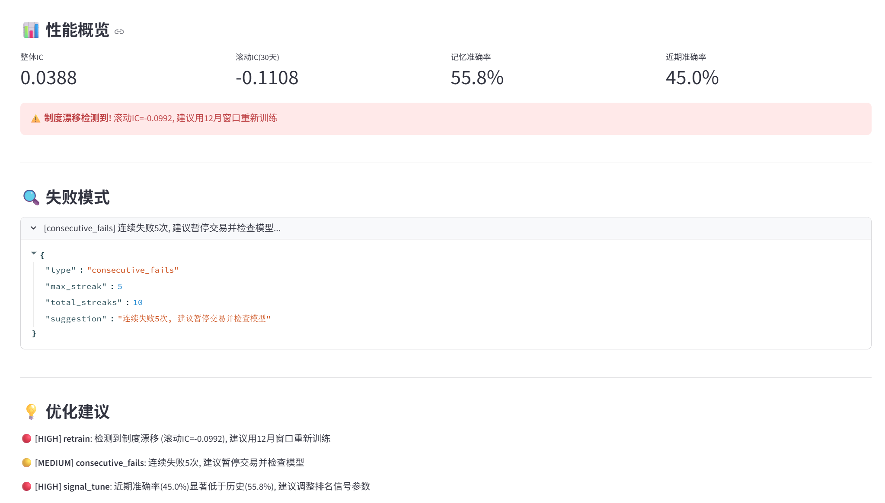
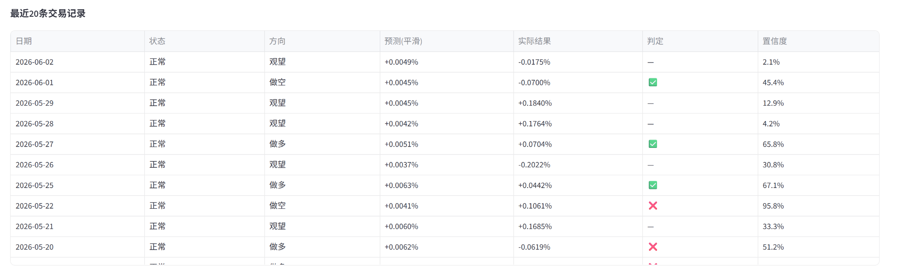
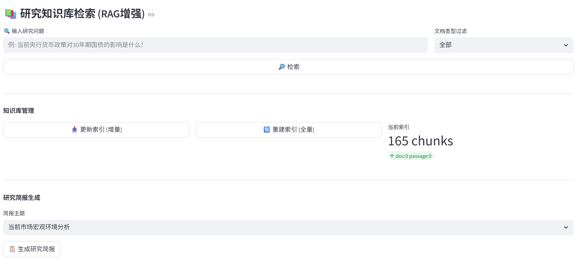
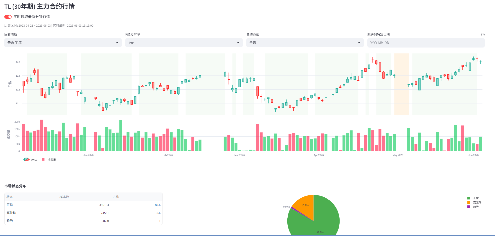

# F_Agent — 30年期国债期货智能量化策略系统

[](https://www.python.org/)
[](https://lightgbm.readthedocs.io/)
[](https://streamlit.io/)

基于 LightGBM 双模型的 TL（30年期国债期货）量化投机策略系统。整合量价、微观结构、基差和宏观因子，使用**甜点区排名信号**，具备**自我迭代能力的AI Agent**。

---

## 📊 核心功能

| 模块 | 功能 |
|------|------|
| **信号看板** | 实时排名信号生成 + 预测走势图 + 甜点区标注 + 绩效快照 |
| **市场监控** | 多分辨率K线(1min~日) + 市场状态着色 + 成交量分布 |
| **因子分析** | Top15特征重要性 + 分位异常预警 + 因子历史分位图 |
| **因子评估** | Alphalens风格 IC排名 + 稳定性散点图 + Spearman相关热力图 |
| **回测表现** | NAV曲线 + 回撤分析 + 日收益分布 + 分状态收益 |
| **宏观环境** | 收益率曲线形态 + 中美利差历史 + 宏观指标趋势 |
| **AI情报** | DeepSeek债券新闻分析 + 量化数据交叉验证 |
| **研究RAG** | ChromaDB检索 + 央行报告/中金所月报/研报语义搜索 + AI生成简报 |
| **交易记忆** | 每日决策记录 + 准确率矩阵 + 状态×方向交叉分析 + AI归因反思 |
| **自我迭代** | 滚动IC监控 + 制度漂移检测 + 失败模式聚类 + 自动参数调优 |
| **模型评估** | 滚动窗口IC + 基线对比 + 退化检测 + 滚动IC趋势图 |
| **超参优化** | Optuna贝叶斯超参搜索 + 多模型集成 + 多时域预测 |
| **定时调度** | 6个自动化任务 + 一键运行/暂停 + 守护进程 |

## 🖼️ Dashboard 预览

### 信号看板 — 实时排名信号 + 甜点区过滤


### 市场监控 — 多分辨率K线 + 成交量


### 因子分析 — 特征重要性 + 分位异常预警


### 回测表现 — NAV曲线 + 回撤分析


### 宏观环境 — 收益率曲线 + 中美利差


### 交易记忆 — 准确率矩阵 + LLM反思


### 自我迭代 — 诊断报告 + 参数自动调优


### 系统概览


## 🏗️ 系统架构

```
┌─────────────────────────────────────────────────────────┐
│                    Data Pipeline                         │
│   AKShare → 分钟行情 · Tick快照 · 宏观数据 · 研报         │
└──────────────────────┬──────────────────────────────────┘
                       ↓
┌─────────────────────────────────────────────────────────┐
│                  Factor Engine (151维)                    │
│  动量·波动率·微观结构·量价·技术·基差·宏观·增强因子         │
│  ┌──────────────────────────────────────────────┐       │
│  │ 新增制度自适应因子 (34个):                      │       │
│  │ OI增长率·波动率突破·ADX趋势·流动性压力·政策冲击  │       │
│  └──────────────────────────────────────────────┘       │
└──────────────────────┬──────────────────────────────────┘
                       ↓
┌─────────────────────────────────────────────────────────┐
│              LightGBM 双模型 Inference                    │
│  Base Model + HighVol/Trend Model → 30min Forward Return │
│  12-Month Rolling Window + 90d Time Decay                │
└──────────────────────┬──────────────────────────────────┘
                       ↓
┌─────────────────────────────────────────────────────────┐
│          甜点区排名信号 (Sweet Spot Ranking)              │
│  做空甜点区: rank 15%-30%  (准确率 72.7%)                │
│  做多甜点区: rank 70%-85%  (准确率 63.6%)                │
│  跳过: 0-15% 极端区 + 85-100% 噪声区                      │
└──────────────────────┬──────────────────────────────────┘
                       ↓
┌─────────────────────────────────────────────────────────┐
│                  Dashboard 13-Tab                         │
│  信号看板·市场监控·因子分析·因子评估·回测·宏观·AI情报      │
│  RAG研究·交易记忆·自我迭代·模型评估·超参优化·定时调度       │
└─────────────────────────────────────────────────────────┘
```

## 📁 项目结构

```
F_Agent/
├── data/                           # 原始数据
│   ├── TL分钟级量价数据.pkl          # 分钟行情 (2023-04 ~ 2026-06, 488K行)
│   ├── TL合约价差日频数据.pkl        # 基差数据 (CTD券)
│   ├── main_contract_spliced.pkl    # 主力合约拼接中间文件
│   ├── tick/                        # 每日tick快照 (.pkl)
│   ├── macro/                       # AKShare 宏观数据缓存
│   └── rag/                         # RAG 索引 (ChromaDB + 研报PDF)
├── docs/                            # 文档 + 截图
│   ├── 01_signal_dashboard.png      # 信号看板
│   ├── 02_market_monitor.png        # 市场监控
│   ├── 03_factor_analysis.png       # 因子分析
│   ├── 04_backtest.png              # 回测表现
│   ├── 05_macro_environment.png     # 宏观环境
│   ├── 07_trade_memory.png          # 交易记忆
│   ├── 08_self_iteration.png        # 自我迭代
│   └── 09_overview.png              # 系统概览
├── models/                          # 训练好的模型
│   ├── trained_model.pkl            # LightGBM 双模型 + scaler
│   └── multi_horizon_model.pkl      # 多时域预测模型
├── outputs/                         # 输出文件
│   ├── df_factors.pkl               # 因子集 (159K行 × 151特征)
│   ├── df_predictions.pkl           # 模型预测结果
│   ├── tick_minute_features.pkl     # tick → 分钟特征
│   ├── macro_factors.pkl            # 宏观因子缓存
│   ├── signal.json                  # 最新交易信号
│   ├── signal_history.csv           # 历史信号记录
│   ├── backtest_metrics.csv         # 回测指标
│   ├── feature_importance.csv       # 特征重要性
│   ├── trade_memory.jsonl           # 交易记忆 (219笔)
│   ├── params.json                  # 信号参数配置
│   ├── cron_jobs.json               # 定时任务配置
│   ├── eval_report_*.md             # 模型评估报告
│   └── iteration_report_*.json      # 自我迭代诊断报告
├── src/                             # 源代码 (22个模块)
│   ├── main.py                      # ★ 入口: --mode train|inference|iterate
│   ├── dashboard_v2.py              # ★ Dashboard V2 (13-Tab)
│   ├── signal_dashboard.py          # ★ 信号引擎 (甜点区排名信号+可视化)
│   ├── self_iteration.py            # ★ 自我迭代引擎 (漂移检测+时间衰减)
│   ├── enhanced_factors.py          # ★ 制度自适应因子 (34个新增)
│   ├── eval_runner.py               # ★ 模型评估套件 (滚动IC+退化检测)
│   ├── factor_evaluator.py          # ★ Alphalens风格因子评估
│   ├── optuna_optimizer.py          # ★ Optuna超参优化+集成+多时域
│   ├── cron_scheduler.py            # ★ 定时任务调度 (daemon模式)
│   ├── retrain_optimized.py         # 全量重训练+窗口扫描
│   ├── factor_extraction.py         # 因子构建主流程
│   ├── LightGBM_model.py            # LightGBM 双模型训练
│   ├── inference.py                 # 实时信号生成器
│   ├── backtest.py                  # 分状态策略回测
│   ├── backtest_v2.py               # 排名信号回测+参数扫描
│   ├── macro_factors.py             # 宏观/资金面因子计算
│   ├── data_fetcher.py              # AKShare 宏观数据采集
│   ├── tick_data_processor.py       # tick → 分钟微观结构
│   ├── mc_ex.py                     # 主力合约拼接+复权
│   ├── update_market_data.py        # 行情数据增量更新
│   ├── strategy_agent.py            # CLI Agent 交互层
│   ├── llm_intelligence.py          # DeepSeek AI 情报分析
│   ├── rag_tool.py                  # RAG 研究工具 (爬虫+ChromaDB+LLM)
│   └── memory.py                    # 交易记忆系统
├── agentic_rag/                     # RAG 本地知识库文档
├── tools/                           # 辅助脚本
├── launch_dashboard.bat             # 一键启动 Dashboard (端口8503)
├── requirements.txt                 # Python 依赖
└── README.md                        # 本文件
```

## 🚀 快速开始

```bash
# 1. 安装依赖
pip install -r requirements.txt

# 2. 设置 API Key (AI情报 & RAG 问答)
set DEEPSEEK_API_KEY=your_deepseek_api_key

# 3. 每日更新行情数据
cd src
python update_market_data.py

# 4. 启动 Dashboard (推荐)
双击 launch_dashboard.bat
浏览器访问: http://localhost:8503

# 5. CLI 工具
python main.py --mode train       # 因子构建 + 训练 + 回测
python main.py --mode inference   # 因子更新 + 实时信号
python main.py --mode iterate     # 自我迭代诊断报告
python eval_runner.py             # 滚动窗口模型评估
python factor_evaluator.py        # Alphalens风格因子评估
python optuna_optimizer.py        # Optuna贝叶斯超参优化
python cron_scheduler.py list     # 查看定时任务
```

## ⚙️ 信号参数

当前使用**甜点区排名信号**（基于219笔交易记忆回测优化，2026-06-03）：

| 参数 | 值 | 说明 |
|------|-----|------|
| 平滑窗口 | 60 | EMA平滑跨度 |
| 回看区间 | 480 bar | 排名计算窗口 (~2天) |
| 信号确认 | 10 bar | 连续同向才确认 |
| 做空甜点 | rank 15%-30% | 准确率 72.7% |
| 做多甜点 | rank 70%-85% | 准确率 63.6% |
| 跳过区间 | 0-15%, 85-100% | 极端排名=噪声 |

配置文件: `outputs/params.json`

## 📊 因子体系 (151个特征)

| 类别 | 数量 | 代表因子 |
|------|------|----------|
| 动量 | 7 | Short_Momentum_1D/3D/5D, TSMOM |
| 波动率 | 6 | RV_30, RV_120, Vol_Surge, ATR_14 |
| 微观结构 | 44 | Spread, Imbalance, Signed_Vol, VPIN, HF_RV |
| 量价 | 4 | OI_Volume_Flow, Smart_Money |
| 技术 | 4 | MACD_Hist, RSI, BB_Position |
| 市场状态 | 4 | Market_Regime, Trend_Consistency |
| 基差 | 3 | Basis_ZScore_20, Basis_Trend |
| 宏观 | 14 | CN_US_10Y_Spread, PMI_ZScore, M2_Surprise |
| **增强因子** | **35** | **OI_Growth, Vol_Breakout, ADX, Spread_Stress** |

### Top 10 特征重要性

1. `Macro_Surprise_Composite` (81.0) — 宏观综合意外
2. `CN_US_10Y_Spread` (42.0) — 中美利差
3. `CN_US_10Y_Spread_Z` (39.0) — 利差Z-Score
4. `Mid_Momentum_2M` (36.0) — 中期动量
5. `Basis_ZScore_20` (35.0) — 基差偏离
6. `OI_Growth_20D` (35.0) — 持仓增长率 ★新增
7. `YC_Slope_30Y_10Y` (34.0) — 超长端利差
8. `OI_Growth_5D` (34.0) — 短期仓位 ★新增
9. `YC_Momentum_5D` (32.0) — 收益率动量
10. `PMI_ZScore` (32.0) — PMI 偏离

## 🧠 自我迭代引擎

```
交易记忆 ──→ 性能监控 ──→ 制度漂移检测 ──→ 自动建议
    │              │              │
    └── 失败模式分析 ──→ 参数调优 ──→ 迭代闭环
```

- **滚动IC监控**: 30天窗口，检测IC连续转负
- **制度漂移警报**: 自动建议重训练窗口
- **失败模式聚类**: 识别状态/方向偏误
- **时间衰减加权**: 借鉴Dexter，近期交易权重更高（30天/14天半衰）
- **参数自动调优**: 基于记忆统计推荐最优阈值

```bash
python main.py --mode iterate
```

## 📈 模型表现

| 指标 | 原始模型 (V0) | 优化后 (V2) |
|------|:-----------:|:---------:|
| 训练窗口 | 9月+60天 | 12月+90天 |
| 特征数 | 56 | 91 |
| Test IC | 0.0150 | 0.0388 |
| Normal IC | **-0.200** | **0.0536** |
| 信号方式 | 绝对阈值 | 甜点区排名 |
| 数据覆盖 | 2023-04 ~ 2025-10 | 2023-04 ~ 2026-06 |

## 🤖 自动化调度

借鉴 Dexter cron 设计，6个预置定时任务：

| 任务 | 频率 | 功能 |
|------|------|------|
| 每日行情更新 | 工作日 16:00 | AKShare拉取最新分钟行情 |
| 每日信号生成 | 工作日 16:00 | 基于最新数据生成信号 |
| 每周模型评估 | 周五 17:00 | 滚动窗口IC评估+退化检测 |
| 每周记忆回填 | 周五 17:00 | 同步交易记忆与实际结果 |
| 月度重训练 | 每月1号 | 全量因子重建+窗口扫描 |
| 月度自迭代 | 每月1号 | 运行诊断+制度漂移检测 |

```bash
python cron_scheduler.py list              # 查看所有任务
python cron_scheduler.py run daily_update  # 手动运行
python cron_scheduler.py daemon            # 后台守护进程
```

## 🔧 技术栈

`Python 3.12` `LightGBM 4.6` `scikit-learn` `AKShare` `Streamlit 1.52` `Plotly` `DeepSeek V4` `ChromaDB` `BGE-small-zh` `sentence-transformers` `Optuna` `Bun (dexter)`

## 📄 免责声明

本项目仅供学习和研究使用，不构成任何投资建议。量化策略基于历史数据回测，过往表现不代表未来收益。
