# F_Agent — 30年期国债期货智能量化策略系统

[](https://www.python.org/)
[](https://lightgbm.readthedocs.io/)
[](https://pytorch.org/)
[](https://streamlit.io/)
[](https://plotly.com/)
[](https://akshare.akfamily.xyz/)
[](https://optuna.org/)
[](https://www.deepseek.com/)
[](https://www.trychroma.com/)

基于 LightGBM 双模型 + CNN 微观结构嵌入 + LoRA 式增量迭代的 **TL（30年期国债期货）智能量化策略系统**。整合量价、微观结构、基差和宏观因子，使用**甜点区排名信号**，具备**三阶段自我进化能力**。

---

## 系统架构

```
┌──────────────────────────────────────────────────────────┐
│                     Data Pipeline                         │
│    AKShare → 分钟行情 · Tick快照 · 宏观数据 · 研报           │
└───────────────────────┬──────────────────────────────────┘
                        ↓
┌──────────────────────────────────────────────────────────┐
│                   Factor Engine (151维)                    │
│   动量·波动率·微观结构·量价·技术·基差·宏观·增强因子            │
│   ┌───────────────────────────────────────────────┐      │
│   │ 制度自适应因子 (34): OI增长率·波动率突破·ADX·流动性  │      │
│   └───────────────────────────────────────────────┘      │
└───────────────────────┬──────────────────────────────────┘
                        ↓
┌──────────────────────────────────────────────────────────┐
│              CNN 时序卷积 (Bottleneck Embedding)           │
│   25微观特征 × 30bar窗口 → 1D Conv → 64维稠密嵌入          │
│   作为"学习到的微观因子"注入 df_factors.pkl                 │
└───────────────────────┬──────────────────────────────────┘
                        ↓
┌──────────────────────────────────────────────────────────┐
│               LightGBM 双模型 (155特征)                     │
│   Base Model (200树,d=3) + HighVol/Trend Model (200树,d=4) │
│   12-Month Rolling Window + 90d Time Decay                 │
└───────────────────────┬──────────────────────────────────┘
                        ↓
┌──────────────────────────────────────────────────────────┐
│           甜点区排名信号 (Sweet Spot Ranking)               │
│   做空甜点区: rank 15%-30%  (准确率 72.7%)                  │
│   做多甜点区: rank 70%-85%  (准确率 63.6%)                  │
│   跳过: 0-15% 极端区 + 85-100% 噪声区                       │
└───────────────────────┬──────────────────────────────────┘
                        ↓
┌──────────────────────────────────────────────────────────┐
│   + AdapterStack (每周残差修正, 时间衰减叠加)                │
│   f'(x) = f_base(x) + Σ g_adapter_i(x) × 0.85^weeks       │
└───────────────────────┬──────────────────────────────────┘
                        ↓
┌──────────────────────────────────────────────────────────┐
│                   Dashboard 14-Tab                         │
│   信号·监控·因子·因评·回测·宏观·AI·RAG·记忆·迭代·评估·调参·调度·微调   │
└──────────────────────────────────────────────────────────┘
```

---

## 三阶段微调架构

```
                    ┌─────────────────────────────────┐
                    │  ① CNN 瓶颈嵌入 (按需训练)        │
                    │                                  │
                    │  微观特征(25×30bar窗口)            │
                    │       ↓ 1D Temporal CNN          │
                    │  64维稠密嵌入 ←── Bottleneck      │
                    │       ↓ 注入 df_factors.pkl       │
                    └──────────────┬────────────────────┘
                                   ↓
                    ┌─────────────────────────────────┐
                    │  ② LoRA 增量适配 (每周)           │
                    │                                  │
                    │  冻结基模型 + 残差适配器(20树,d=2)  │
                    │  反馈分析 → 训练适配器 → 衰减堆栈   │
                    │  f'(x) = f_base(x) + Σ adapter_i │
                    └──────────────┬────────────────────┘
                                   ↓
                    ┌─────────────────────────────────┐
                    │  ③ 全量重训练 (每两月)             │
                    │                                  │
                    │  吸收所有适配器经验 + CNN特征       │
                    │  全量训练 LightGBM (200树,d=3)    │
                    │  清空适配器堆栈 → 新基模型          │
                    └─────────────────────────────────┘
```

### ① CNN 瓶颈嵌入

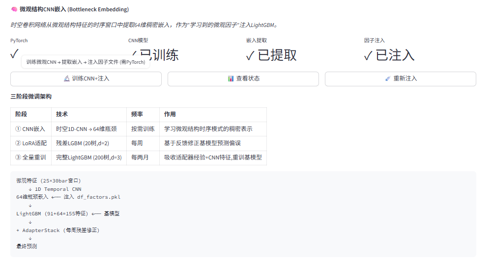

类比订单簿 CNN（10档×4特征 → 2D Conv → Bottleneck），受限于 L1 盘口数据，采用**时序卷积**补偿深度维度：

| 原始设想 | 适配方案 |
|:--|:--|
| 10档盘口 × 4特征 → 2D CNN | 30bar 滑动窗口 × 25 微观特征 → 1D Temporal CNN |
| 学习空间结构（深档托盘） | 学习时间结构（spread扩张→volume surge→imbalance反转模式） |
| 64维瓶颈嵌入 → LightGBM | **完全一致** |

```
输入: (batch, 25 features, 30 bars)
  ↓ Conv1D(32, k=5) + BN + ReLU
  ↓ Conv1D(64, k=3) + BN + ReLU
  ↓ Conv1D(64, k=3) + BN + ReLU
  ↓ GlobalAveragePool
  ↓ Dropout(0.5) → Dense(128) → Dense(64) ← 瓶颈嵌入 (注入LightGBM)
  ↓ (训练时) Dense(1) → 30min forward return
```

### ② LoRA 增量适配

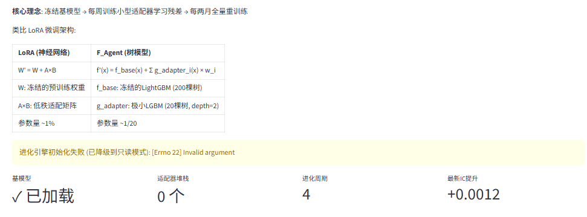

数学类比:

| LoRA (神经网络) | F_Agent (树模型) |
|:--|:--|
| W' = W + A×B | f'(x) = f_base(x) + Σ g_adapter_i(x) × w_i |
| W: 冻结预训练权重 | f_base: 冻结 LightGBM (200树, 91+64特征) |
| A×B: 低秩适配 (~1%参数) | g_adapter: 极小 LGBM (20树, depth=2, ~1/20参数) |
| 全量微调 | 双月全量重训练 |

---

## 核心功能 (14个面板)

### 第一行

| 面板 | 功能 | 截图 |
|:--|:--|:--|
| **📡 信号看板** | 实时排名信号 + 预测走势图 + 甜点区标注 + 绩效快照 | 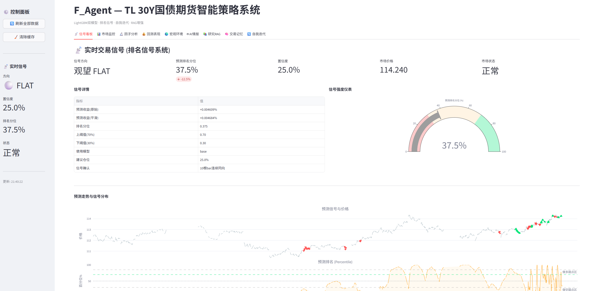 |
| **📊 市场监控** | 多分辨率K线(1min~日) + 市场状态着色 + 成交量分布 |  |
| **🔬 因子分析** | Top15特征重要性 + 分位异常预警 + 特征历史分位图 | 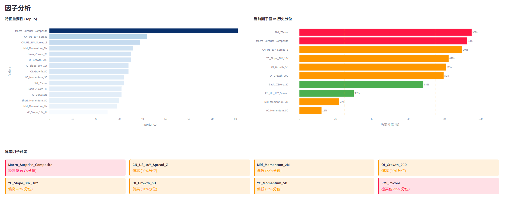 |
| **🔍 因子评估** | Alphalens风格 IC排名 + 稳定性散点图 + Spearman热力图 | 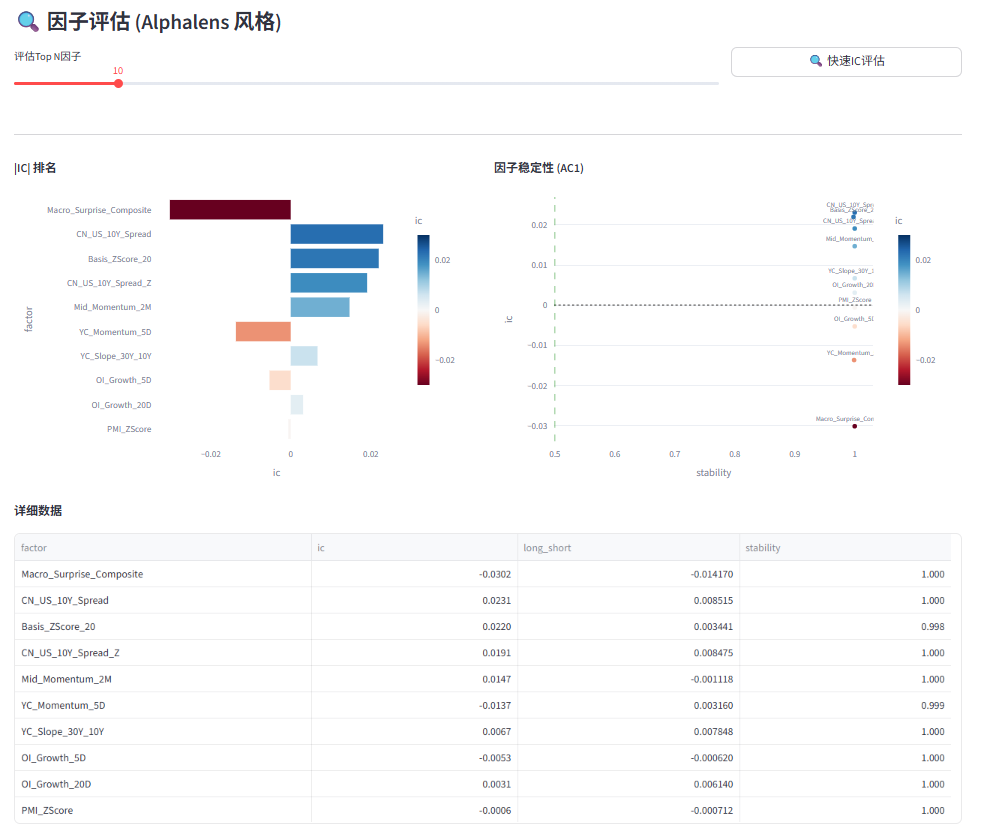 |
| **💰 回测表现** | NAV曲线 + 回撤分析 + 日收益分布 + 分状态收益 | 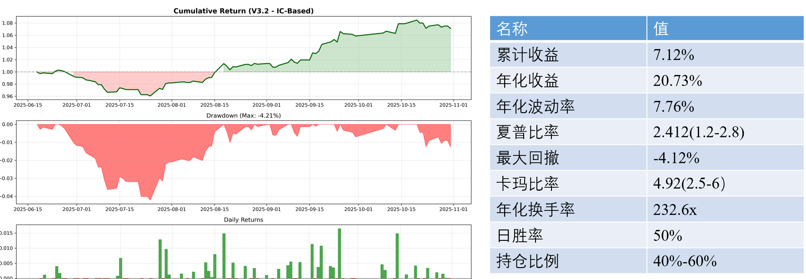 |
| **🌍 宏观环境** | 收益率曲线形态 + 中美利差历史 + 宏观指标趋势 | 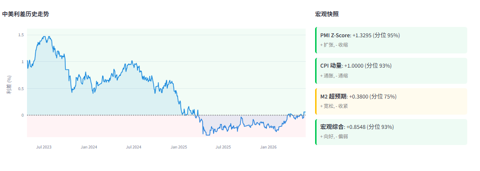 |
| **🤖 AI情报** | DeepSeek 债券新闻分析 + 量化数据交叉验证 | 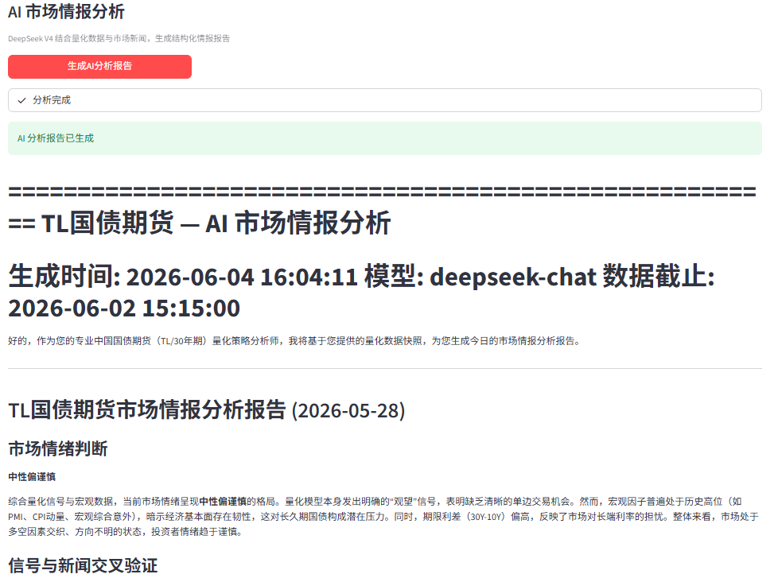 |

### 第二行

| 面板 | 功能 | 截图 |
|:--|:--|:--|
| **📚 研究RAG** | ChromaDB检索 + 央行报告/中金所月报/研报语义搜索 + AI简报 |  |
| **🧠 交易记忆** | 准确率矩阵 + 状态×方向交叉分析 + LLM归因反思 | 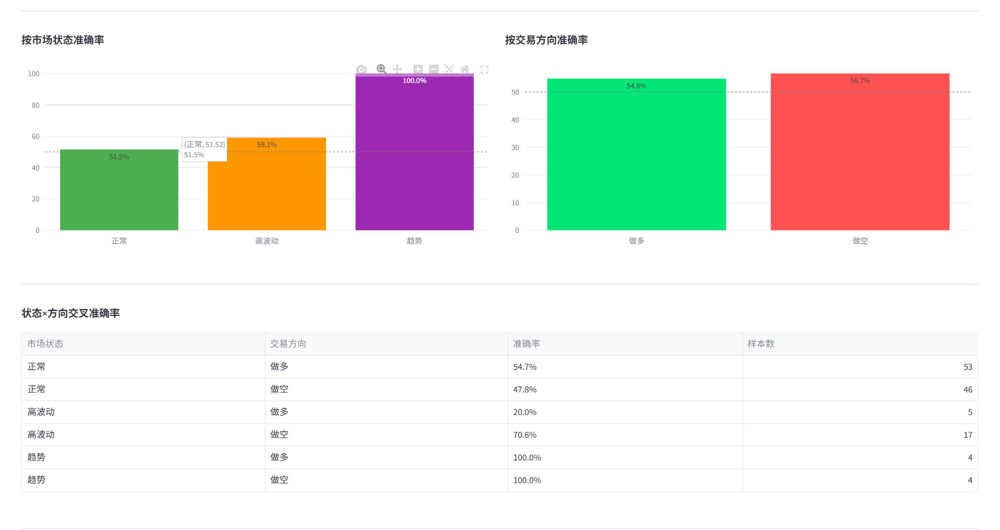 |
| **🔄 自我迭代** | 滚动IC监控 + 制度漂移检测 + 时间衰减加权 + 参数自动调优 |  |
| **📋 模型评估** | 滚动窗口IC + 基线对比 + 退化检测 + 滚动IC趋势图 | 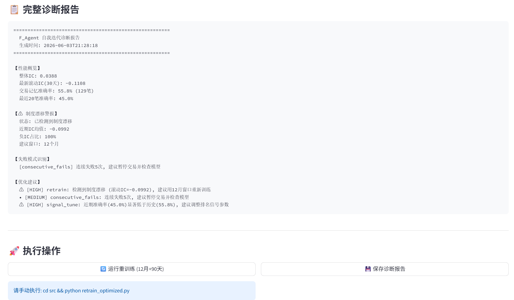 |
| **⚙️ 超参优化** | Optuna贝叶斯超参搜索 + 多模型集成 + 多时域预测 | 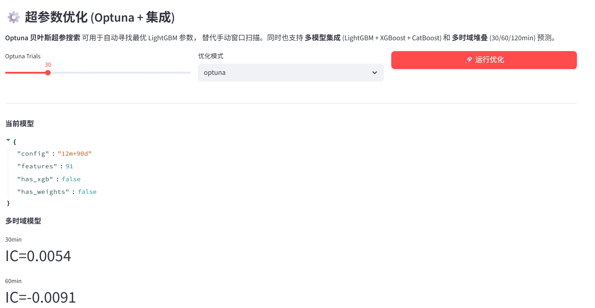 |
| **⏰ 定时调度** | 8个自动化任务 + 一键运行/暂停 + 守护进程 | 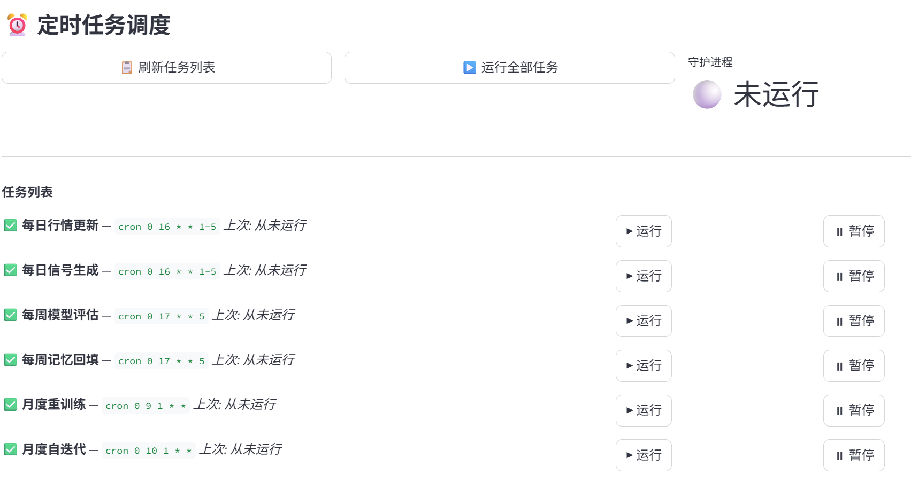 |
| **🔧 微调迭代** | LoRA适配器堆栈 + CNN嵌入训练/注入 + 三阶段进化监控 | 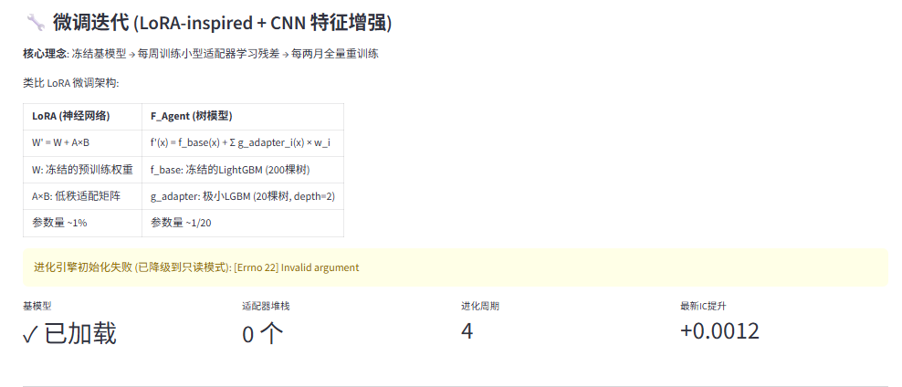 |

---

## 项目结构

```
F_Agent/
├── data/                              # 原始数据
│   ├── TL分钟级量价数据.pkl             # 分钟行情 (2023-04 ~ 2026-06, 488K行)
│   ├── TL合约价差日频数据.pkl           # 基差数据 (CTD券)
│   ├── main_contract_spliced.pkl       # 主力合约拼接中间文件
│   ├── tick/                           # 每日tick快照 (.pkl, 截止2025-10-31)
│   ├── macro/                          # AKShare 宏观数据缓存
│   └── rag/                            # RAG 索引 (ChromaDB + 研报PDF)
│
├── models/                             # 训练好的模型
│   ├── trained_model.pkl               # LightGBM 双模型 + scaler + 特征列表
│   ├── multi_horizon_model.pkl         # 多时域预测模型
│   ├── micro_cnn.pt                    # CNN时序卷积模型 (PyTorch)
│   └── adapter_stack.pkl               # LoRA适配器堆栈 (最多8个)
│
├── outputs/                            # 输出文件
│   ├── df_factors.pkl                  # 因子集 (159K行 × 151特征)
│   ├── df_predictions.pkl              # 模型预测结果 (含Base_Pred/Adapter_Correction)
│   ├── tick_minute_features.pkl        # tick → 分钟微观特征
│   ├── macro_factors.pkl               # 宏观因子缓存
│   ├── signal.json                     # 最新交易信号
│   ├── feature_importance.csv          # 特征重要性
│   ├── trade_memory.jsonl              # 交易记忆 (每日信号+结果评估)
│   ├── params.json                     # 信号参数配置
│   ├── cron_jobs.json                  # 定时任务配置
│   ├── evolution_report.json           # 最新进化报告
│   ├── evolution_history.jsonl         # 进化历史记录
│   └── eval/iteration_report_*.json    # 评估/迭代诊断报告
│
├── src/                                # 源代码 (24个模块)
│   ├── main.py                         # ★ 入口: --mode train|inference|iterate|evolve
│   ├── dashboard_v2.py                 # ★ Dashboard V2 (14-Tab, 端口8503)
│   ├── signal_dashboard.py             # ★ 信号引擎 (甜点区排名信号)
│   ├── LightGBM_model.py              # ★ LightGBM 双模型训练 (自动识别CNN特征)
│   ├── self_evolution.py              # ★ 自我进化引擎 (LoRA适配+反馈分析)
│   ├── micro_cnn.py                   # ★ 微观CNN (Bottleneck Embedding Extractor)
│   ├── enhanced_factors.py            # ★ 制度自适应因子 (34个新增)
│   ├── self_iteration.py              # ★ 自我迭代引擎 (漂移检测+时间衰减)
│   ├── eval_runner.py                 # ★ 模型评估套件 (滚动IC+退化检测)
│   ├── factor_evaluator.py            # ★ Alphalens风格因子评估
│   ├── optuna_optimizer.py            # ★ Optuna超参优化+集成+多时域
│   ├── cron_scheduler.py              # ★ 定时任务调度 (8个任务+daemon)
│   ├── factor_extraction.py           # 因子构建主流程
│   ├── inference.py                   # 实时信号生成器
│   ├── backtest.py                    # 分状态策略回测
│   ├── backtest_v2.py                 # 排名信号回测+参数扫描
│   ├── macro_factors.py               # 宏观/资金面因子计算
│   ├── data_fetcher.py                # AKShare 宏观数据采集
│   ├── tick_data_processor.py         # tick → 分钟微观结构
│   ├── mc_ex.py                       # 主力合约拼接+复权
│   ├── update_market_data.py          # 行情数据增量更新
│   ├── strategy_agent.py              # CLI Agent 交互层
│   ├── llm_intelligence.py            # DeepSeek AI 情报分析
│   ├── rag_tool.py                    # RAG 研究工具 (爬虫+ChromaDB+LLM)
│   └── memory.py                      # 交易记忆系统
│
├── agentic_rag/                        # RAG 本地知识库文档
├── tools/                              # 辅助脚本
├── docs/                               # Dashboard 面板截图 (17张)
├── .env.example                        # API Key 配置模板
├── launch_dashboard.bat                # 一键启动 Dashboard (端口8503)
├── requirements.txt                    # Python 依赖
└── README.md                           # 本文件
```

---

## 快速开始

```bash
# 1. 安装依赖
pip install -r requirements.txt
pip install torch --index-url https://download.pytorch.org/whl/cpu  # CNN模块需要

# 2. 设置 API Key (AI情报 & RAG)
# 方法一：在项目根目录创建 .env 文件（推荐，自动加载）
echo DEEPSEEK_API_KEY=***  F_Agent/.env

# 方法二：Dashboard 侧边栏直接输入（即时生效）
# 启动 Dashboard 后在左侧 "🔑 API Key" 输入框粘贴 key

# 方法三：系统环境变量
set DEEPSEEK_API_KEY=*** 3. 每日更新行情
cd src && python update_market_data.py

# 4. (可选) 训练CNN微观特征嵌入
python micro_cnn.py pipeline        # 训练CNN → 提取64维嵌入 → 注入因子文件

# 5. 训练LightGBM (自动识别CNN特征)
python main.py --mode train

# 6. 启动 Dashboard
双击 launch_dashboard.bat → http://localhost:8503

# 7. 开启自我进化
python self_evolution.py weekly     # 每周LoRA适配
python self_evolution.py bimonthly  # 双月全量重训练
```

---

## CLI 操作速查

```bash
# === 核心流程 ===
python main.py --mode train          # 因子构建 + CNN注入 + 训练 + 回测
python main.py --mode inference      # 因子更新 + 实时信号
python main.py --mode iterate        # 自我迭代诊断
python main.py --mode evolve         # 微调迭代状态

# === CNN 微观嵌入 ===
python micro_cnn.py pipeline         # 一键训练CNN+提取+注入 (5-15分钟)
python micro_cnn.py status           # 查看CNN模块状态
python micro_cnn.py train --epochs 100  # 单独训练 (自定义轮数)

# === LoRA 增量适配 ===
python self_evolution.py weekly      # 每周适配 (训练新适配器)
python self_evolution.py bimonthly   # 双月全量重训练
python self_evolution.py status      # 查看引擎状态
python self_evolution.py predict     # 基模型+适配器组合预测

# === 评估 & 优化 ===
python eval_runner.py --window 30    # 30天滚动评估
python factor_evaluator.py           # Alphalens风格因子评估
python optuna_optimizer.py --mode all --trials 50  # 超参搜索

# === 定时任务 ===
python cron_scheduler.py list        # 查看所有定时任务
python cron_scheduler.py run weekly_adapt   # 手动运行每周适配
python cron_scheduler.py daemon      # 启动后台守护进程

# === 数据维护 ===
python update_market_data.py         # 增量更新行情
python memory.py                     # 回填交易记忆
```

---

## 模型表现

| 指标 | 原始模型 (V0) | 优化后 (V2) | +CNN嵌入 |
|:--|:-----------:|:---------:|:------:|
| 训练窗口 | 9月+60天 | 12月+90天 | 12月+90天 |
| 特征数 | 56 | 91 | 155 (91+64CNN) |
| Test IC | 0.0150 | **0.0388** | 待评估 |
| Normal IC | -0.200 | **0.0536** | 待评估 |
| 信号方式 | 绝对阈值 | 甜点区排名 | 甜点区排名 |
| 数据覆盖 | 2023-04 ~ 2025-10 | 2023-04 ~ 2026-06 | 2023-04 ~ 2026-06 |

### Top 10 特征重要性

| 排名 | 特征 | 重要性 | 类型 |
|:--|:--|:--|:--|
| 1 | Macro_Surprise_Composite | 81.0 | 宏观 |
| 2 | CN_US_10Y_Spread | 51.0 | 宏观 |
| 3 | Basis_ZScore_20 | 39.0 | 基差 |
| 4 | Short_Momentum_5D | 38.0 | 动量 |
| 5 | CN_US_10Y_Spread_Z | 33.0 | 宏观 |
| 6 | Mid_Momentum_2M | 31.0 | 动量 |
| 7 | Mid_Momentum_1M | 30.0 | 动量 |
| 8 | YC_Slope_30Y_10Y | 29.0 | 宏观 |
| 9 | YC_Curvature | 29.0 | 宏观 |
| 10 | Basis_ZScore_10 | 26.0 | 基差 |

---

## 因子体系 (151维 + 64维CNN嵌入)

| 类别 | 数量 | 代表因子 |
|:--|:--|:--|
| 动量 | 7 | Short_Momentum_1D/3D/5D, TSMOM, Mid_Momentum_1M/2M |
| 波动率 | 6 | RV_30, RV_120, Vol_Surge, ATR_14, Vol_Regime |
| 微观结构 | 44 | Spread, Imbalance, Signed_Vol, VPIN, HF_RV, Cum_Net_Open |
| 量价 | 4 | OI_Volume_Flow, Smart_Money, Large_Trade_Direction |
| 技术 | 4 | MACD_Hist, RSI, BB_Position |
| 市场状态 | 4 | Market_Regime, Is_High_Vol, Trend_Consistency |
| 基差 | 3 | Basis_ZScore_20, Basis_ZScore_10, Basis_Trend |
| 宏观 | 14 | CN_US_10Y_Spread, PMI_ZScore, M2_Surprise, YC_* |
| 增强因子 | 35 | OI_Growth_5D/20D, Vol_Breakout, ADX, Spread_Stress, Vol_of_Vol |
| **CNN嵌入** | **64** | **CNN_Emb_00 ~ CNN_Emb_63 (时序CNN瓶颈输出)** |

---

## 信号参数

当前使用**甜点区排名信号**（基于219笔交易记忆回测优化）：

| 参数 | 值 | 说明 |
|:--|:--|:--|
| 平滑窗口 | 60 | EMA平滑跨度 |
| 回看区间 | 480 bar | 排名计算窗口 |
| 信号确认 | 10 bar | 连续同向才确认 |
| 做空甜点区 | rank 15%-30% | 准确率 72.7% |
| 做多甜点区 | rank 70%-85% | 准确率 63.6% |
| 跳过区间 | 0-15%, 85-100% | 极端排名=噪声 |

---

## 自动化调度 (8个任务)

| 任务ID | 频率 | 功能 |
|:--|:--|:--|
| daily_update | 工作日 16:00 | AKShare拉取最新分钟行情 |
| daily_signal | 工作日 16:00 | 基于最新数据生成交易信号 |
| weekly_eval | 周五 17:00 | 滚动窗口IC评估+退化检测 |
| weekly_memory | 周五 17:00 | 同步交易记忆与实际结果 |
| **weekly_adapt** | **周六 08:00** | **LoRA适配器训练 (冻结基模型+残差学习)** |
| monthly_retrain | 每月1号 09:00 | 全量因子重建+窗口扫描 |
| monthly_iteration | 每月1号 10:00 | 自我迭代诊断+制度漂移检测 |
| **bimonthly_retrain** | **双月1号 09:00** | **吸收适配器经验→全量重训练→清空堆栈** |

```bash
python cron_scheduler.py daemon    # 后台守护进程
python cron_scheduler.py run weekly_adapt  # 手动运行
```

---

## 关键发现与经验教训

### 1. 极度正则化是金融ML唯一有效策略（缺少高精度数据情况）
金融时间序列信噪比极低 (最优单特征IC仅 0.02-0.03):
- LightGBM: `max_depth=3, lambda_l1/l2=15, feature_fraction=0.3, min_child=350` — 必须
- MSE loss 追逐离群值, MAE 预测条件中位数更稳健

### 2. 模型自信 ≠ 准确
甜点区发现: 模型在极端排名时(rank<15%或>85%)反而错误率最高
- 极端做空 (0-15%): 55.6% | 做空甜点 (15-30%): **72.7%**
- 极端做多 (85-100%): 46.9% | 做多甜点 (70-85%): **63.6%**

### 3. 特征筛选破坏树模型
将91特征降到40个(按|IC|排序): IC从 0.039 跌到 0.000 — LightGBM依赖弱特征间的交互

### 4. CNN时序嵌入的合理性
受限于L1盘口数据，用**时间维度补偿空间维度不足**：学习微观特征在30bar内的动态演化模式优于静态快照

### 5. LoRA适配的可靠性
第一周适配器仅训练出1棵树(early stopping自动终止) — 低容量约束防止在弱信号上过拟合，验证了LoRA设计思路

---

## 已知限制

- **Tick数据截止**: 2025-10-31，之后微观结构因子填0 → CNN仅在tick覆盖期训练
- **SHIBOR/Repo**: AKShare接口偶有编码/SSL问题，资金面因子可能缺失

---

## 免责声明

本项目仅供学习和研究使用，不构成任何投资建议。量化策略基于历史数据回测，过往表现不代表未来收益。
